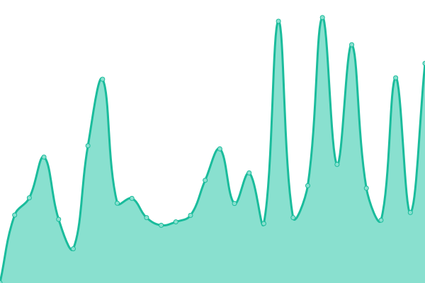
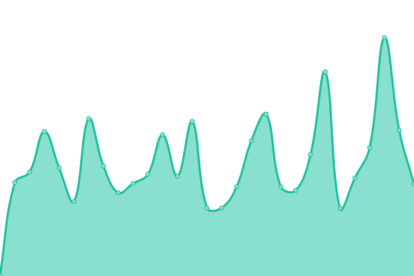
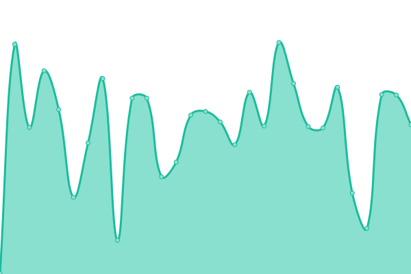
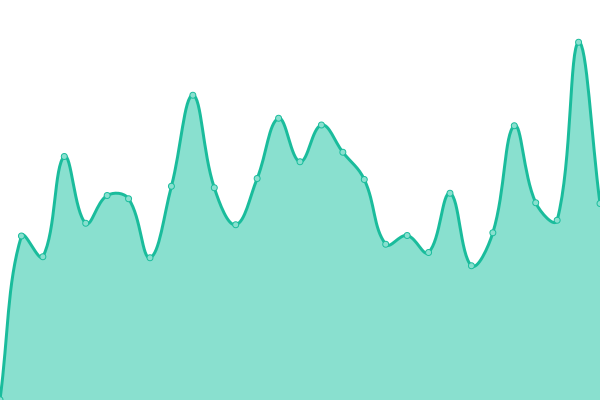
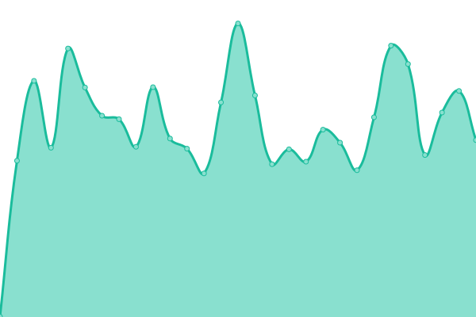

# [📈 Status Atual](https://iguinhus.github.io/clima-creators-status): <!--live status--> **Todos os sistemas operacionais**

This repository contains the open-source uptime monitor and status page for [Igor de Holanda Chagas](https://iguinhus.github.io/clima-creators-status), powered by [Upptime](https://github.com/upptime/upptime).

With [Upptime](https://upptime.js.org), you can get your own unlimited and free uptime monitor and status page, powered entirely by a GitHub repository. We use [Issues](https://github.com/iguinhus/clima-creators-status/issues) as incident reports, [Actions](https://github.com/iguinhus/clima-creators-status/actions) as uptime monitors, and [Pages](https://iguinhus.github.io/clima-creators-status) for the status page.

## [📈 Live Status](https://demo.upptime.js.org): <!--live status--> **Todos os sistemas operacionais**

<!--start: status pages-->
<!-- This summary is generated by Upptime (https://github.com/upptime/upptime) -->
<!-- Do not edit this manually, your changes will be overwritten -->
<!-- prettier-ignore -->
| URL | Status | History | Response Time | Uptime |
| --- | ------ | ------- | ------------- | ------ |
|  [Clima Creators (Dev)](https://climacreators.vercel.app) | Operacional | [clima-creators-dev.yml](https://github.com/iguinhus/clima-creators-status/commits/HEAD/history/clima-creators-dev.yml) | 

 1052ms
     
 | 

<a href="https://iguinhus.github.io/clima-creators-status/history/clima-creators-dev">100.00%</a>
    

|  [Supabase](https://status.supabase.com) | Operacional | [supabase.yml](https://github.com/iguinhus/clima-creators-status/commits/HEAD/history/supabase.yml) | 

 516ms
     
 | 

<a href="https://iguinhus.github.io/clima-creators-status/history/supabase">99.50%</a>
    

|  [Vercel](https://www.vercel-status.com) | Operacional | [vercel.yml](https://github.com/iguinhus/clima-creators-status/commits/HEAD/history/vercel.yml) | 

 289ms
     
 | 

<a href="https://iguinhus.github.io/clima-creators-status/history/vercel">100.00%</a>
    

|  [Sentry](https://status.sentry.io) | Operacional | [sentry.yml](https://github.com/iguinhus/clima-creators-status/commits/HEAD/history/sentry.yml) | 

 398ms
     
 | 

<a href="https://iguinhus.github.io/clima-creators-status/history/sentry">100.00%</a>
    

|  [PostHog](https://status.posthog.com) | Operacional | [post-hog.yml](https://github.com/iguinhus/clima-creators-status/commits/HEAD/history/post-hog.yml) | 

 885ms
     
 | 

<a href="https://iguinhus.github.io/clima-creators-status/history/post-hog">100.00%</a>
    

|  [Resend](https://resend-status.com) | Operacional | [resend.yml](https://github.com/iguinhus/clima-creators-status/commits/HEAD/history/resend.yml) | 

 624ms
     
 | 

<a href="https://iguinhus.github.io/clima-creators-status/history/resend">100.00%</a>
    

|  [Pluggy](https://status.pluggy.ai) | Operacional | [pluggy.yml](https://github.com/iguinhus/clima-creators-status/commits/HEAD/history/pluggy.yml) | 

 2115ms
     
 | 

<a href="https://iguinhus.github.io/clima-creators-status/history/pluggy">98.80%</a>
    

<!--end: status pages-->

[**Visit our status website →**](https://iguinhus.github.io/clima-creators-status)

## 📄 License

- Powered by: [Upptime](https://github.com/upptime/upptime)
- Code: [MIT](./LICENSE) © [Anand Chowdhary](https://anandchowdhary.com), supported by [Pabio](https://pabio.com)
- Data in the `./history` directory: [Open Database License](https://opendatacommons.org/licenses/odbl/1-0/)
